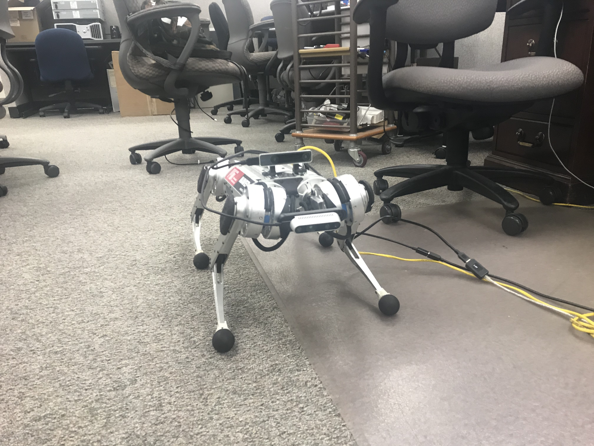
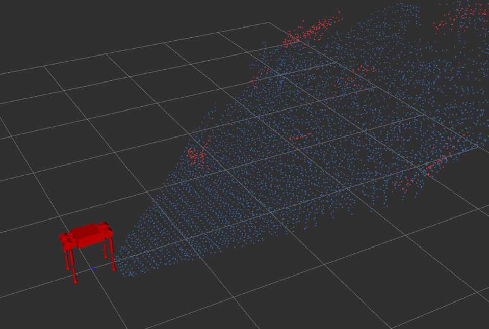
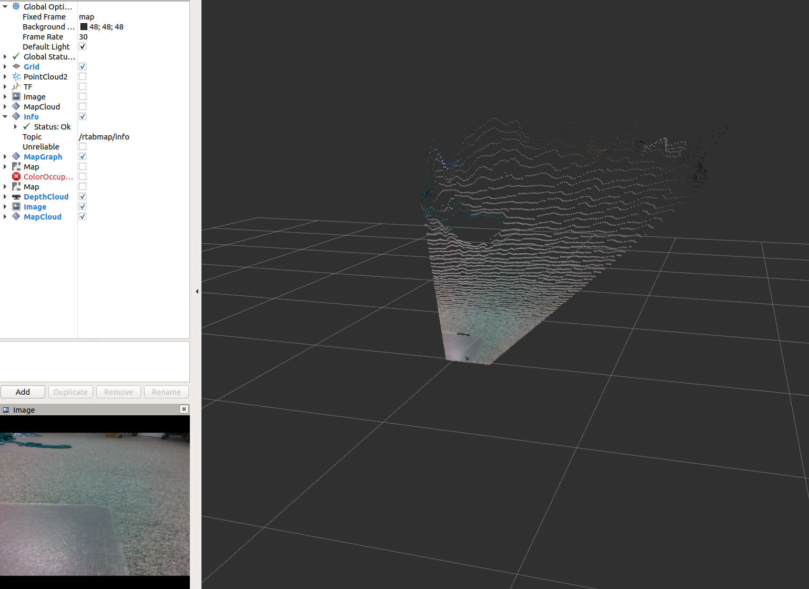
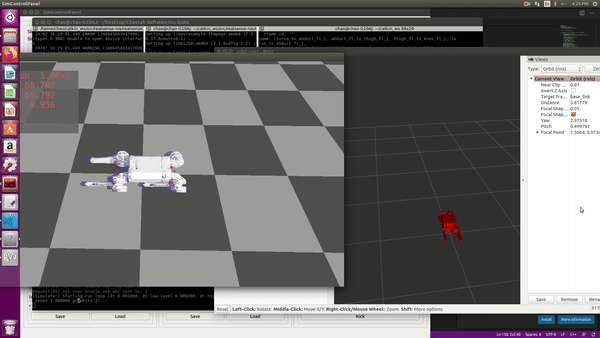

# minicheetah3Dvisulization
This will combine with MiniCheetah code and doing visualization

Installation Guide:
1. PCL 1.11 for Melodic  
   1.11 for melodic          git checkout tags/pcl-1.11.0 -b pcl-1.11.0
    
LCM installation:
  https://github.com/lcm-proj/lcm/releases/download/v1.3.1/lcm-1.3.1.zip
    
2. use beginner_tutorial for listening PCl
3. Vision_opencv  https://github.com/ros-perception/vision_opencv  (Branch:need to be checked out base on your ROS version)
4. Realsense_ROS https://github.com/IntelRealSense/realsense-ros
    Realsense https://github.com/IntelRealSense/librealsense/blob/master/doc/distribution_linux.md
5. depthimage_to_laserscan https://github.com/ros-perception/depthimage_to_laserscan
6. rtabmap https://github.com/introlab/rtabmap_ros refer to this
7. lcm-to-ROS (install lcm prior to this)
    (we recommend 1.3.1, available from here https://github.com/lcm-proj/lcm/releases/download/v1.3.1/lcm-1.3.1.zip)
    To install:
    unzip lcm-1.3.1.zip
    cd lcm-1.3.1
    ./configure
    make -j
    sudo make install
    sudo ldconfig

8. new_joint_state(you may buld this at last)
9. sudo apt install ros-melodic-joint-state-publisher-gui

Replace all launch file in realsense2_camera, and rtabmap.launch in package rtabmap_ros.

If you have any question, please contact joecc@umich.edu

